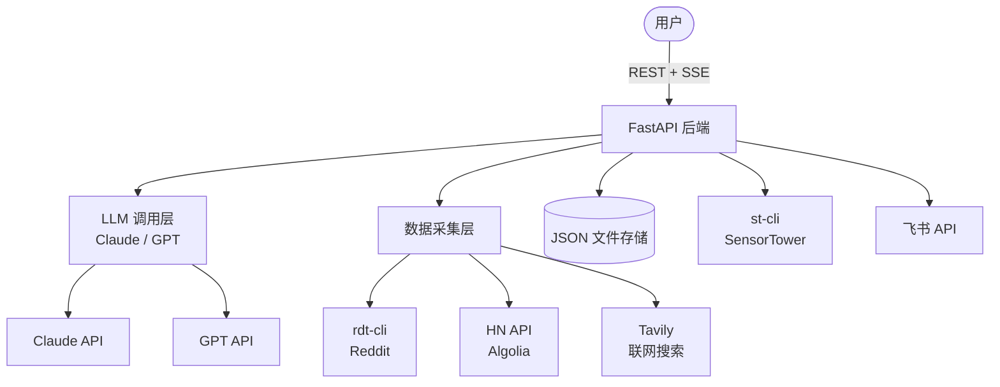
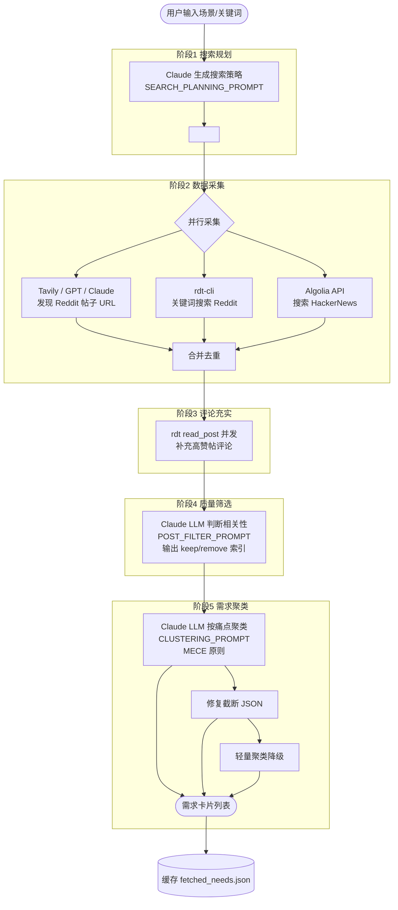
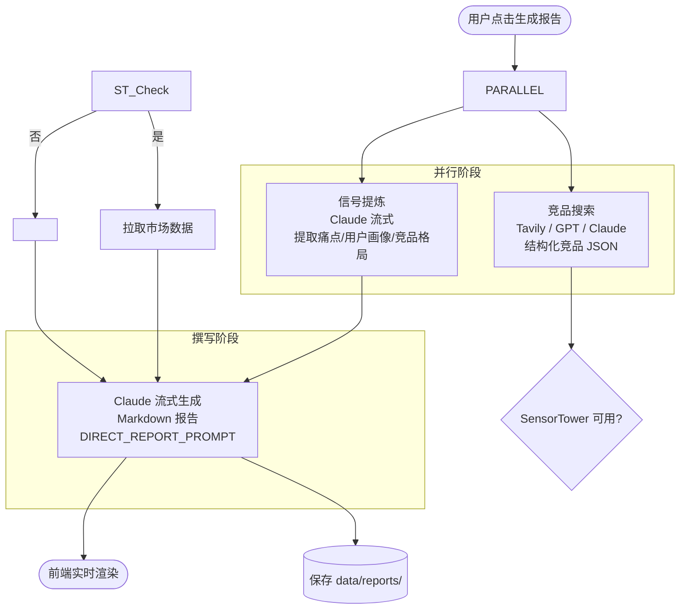
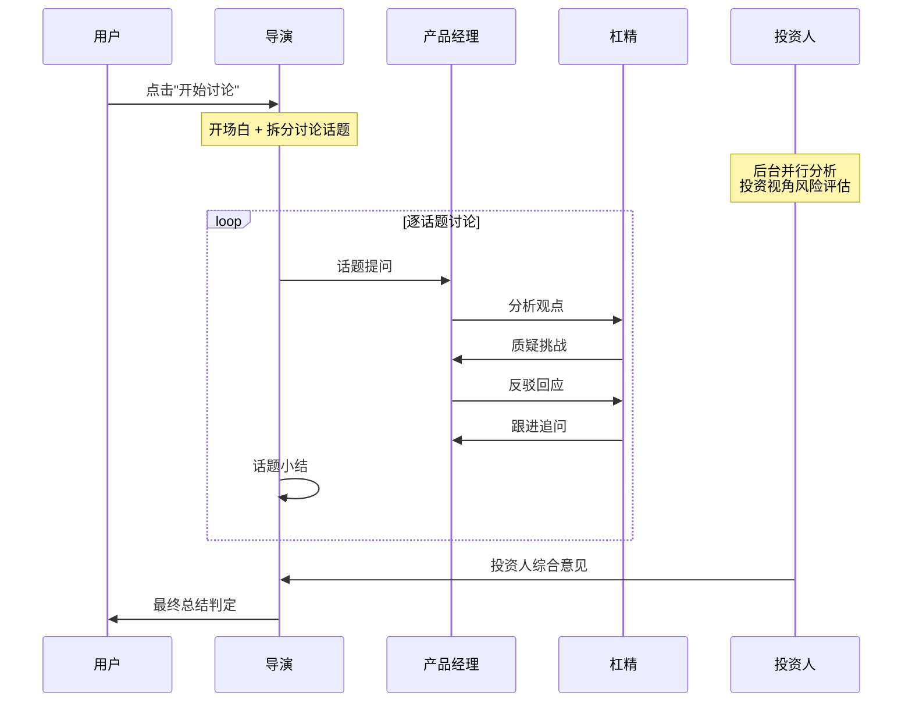
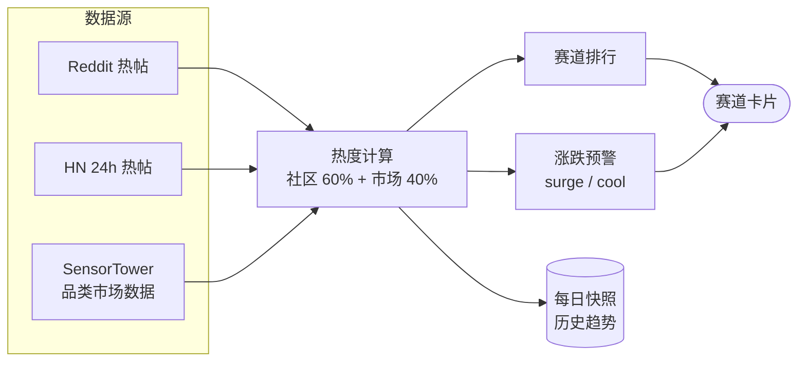
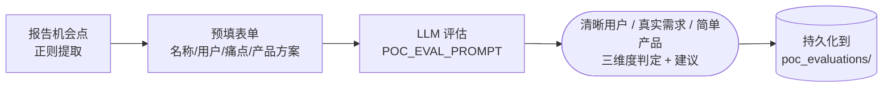
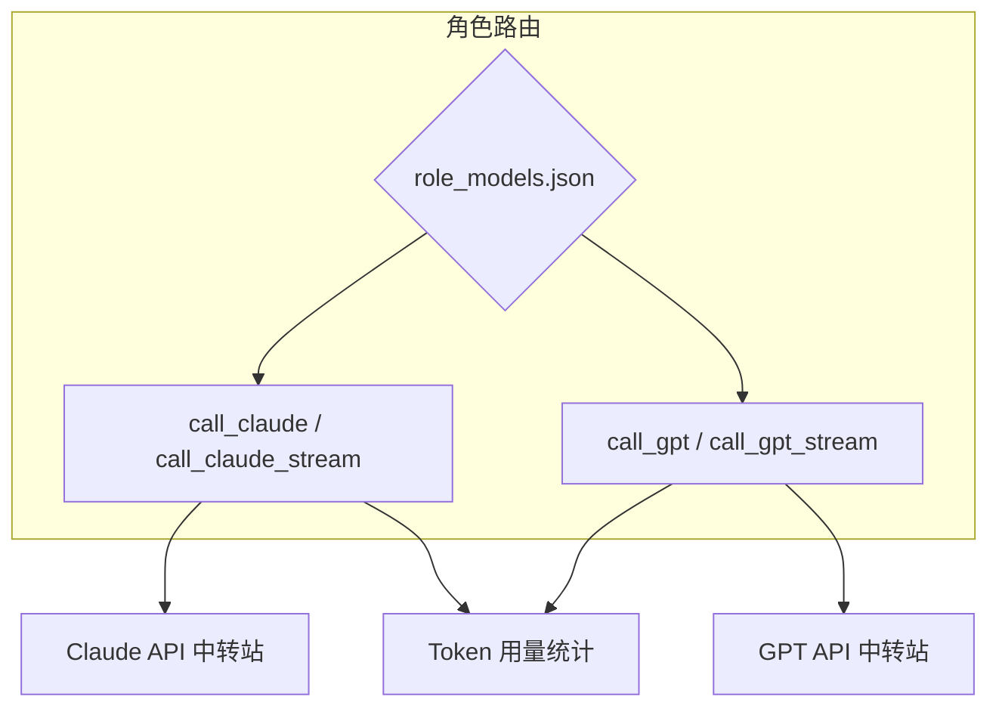

# 需求分析 Agent 系统 — 核心架构

> 本文档聚焦系统核心流程的可视化说明，项目结构和技术栈详见 `README.md` 和 `PROJECT_STRUCTURE.md`。

---

## 1. 系统架构总览

---

## 2. 需求挖掘流程

从用户输入到产出需求卡片的完整链路，是系统最核心的功能。

**典型耗时**：搜索规划 ~30s → 数据采集 ~180s → 评论充实 ~10s → 质量筛选 ~100s → 聚类 ~120s ≈ **总计 7-9 分钟**

---

## 3. 报告生成流程

---

## 4. 多角色讨论系统

四个角色共享同一份 `debate_log`，采用话题分段式讨论，每轮 PM-杠精 对抗后导演小结。

| 角色 | 定位 | LLM 调用 |
|------|------|---------|
| 导演 | 主持人，分话题、做小结 | 开场 + 每话题小结 + 收尾 |
| 产品经理 | 需求拥护者，推销机会 | 初始分析 + 每话题回应 |
| 杠精 | 真实用户视角，平衡质疑 | 每话题挑战 + 跟进 |
| 投资人 | 商业可行性评估 | 后台 1 次分析 + 收尾意见 |

---

## 5. 热度雷达系统

---

## 6. POC 产品准入评价

基于「红毛丹准则」三维度评审产品创意是否值得立项。

---

## 7. LLM 调用与角色路由

每个讨论角色可独立配置 Claude 或 GPT，通过设置界面切换。非讨论场景的 LLM 调用通过「全局模型」设置统一控制。所有调用自动累计 `prompt_tokens` / `completion_tokens`。
